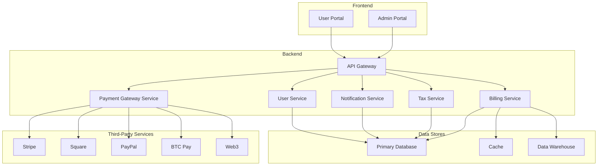

# Comprehensive Design: Multi-Payment Gateway Billing System

# System Architecture: Multi-Payment Gateway Billing System

This document outlines the complete system architecture for the multi-payment gateway billing system. It is based on the comprehensive research conducted in the previous phase and provides a detailed blueprint for the development and implementation of the platform.

## 1. System Architecture Diagram



## 2. Component Specifications

This section will provide detailed specifications for each component of the system, including:

*   **Frontend Portals:** Admin and User Portals
    *   **Admin Portal:** A web-based interface for administrators to manage the entire billing system. Key features include user management, subscription management, invoice management, payment tracking, tax configuration, and reporting.
    *   **User Portal:** A web-based interface for end-users to manage their own subscriptions, view their billing history, update their payment methods, and make payments.
*   **API Gateway:** The single entry point for all client requests. The API gateway will be responsible for request routing, authentication, and rate limiting. It will also provide a unified API for all the backend services.
*   **Billing Service:** The core service responsible for managing subscriptions, invoices, and payments. This service will handle all the business logic related to billing, including creating and managing subscriptions, generating invoices, processing payments, and handling dunning.
*   **Payment Gateway Service:** A service that integrates with multiple payment gateways using the adapter pattern. This service will provide a unified interface for processing payments, regardless of the underlying payment gateway. It will also handle the complexities of integrating with each gateway's API.
*   **Tax Service:** A dedicated service for calculating and managing taxes. This service will be responsible for calculating taxes based on the user's location and the products they are purchasing. It will also handle tax reporting and compliance.
*   **Notification Service:** A service for sending email and other notifications to users. This service will be used to send notifications for events such as new invoices, payment reminders, and subscription renewals.
*   **User Service:** A service for managing user accounts and authentication. This service will be responsible for creating and managing user accounts, as well as authenticating users and managing their permissions.

## 3. Database Schema

This section will define the database schema for the system, including tables for users, tenants, subscriptions, invoices, payments, and tax rates. The detailed schema is available in [design/database_schema.md](design/database_schema.md).

## 4. API Design

This section will provide the OpenAPI/Swagger specifications for the system's APIs. The detailed API design is available in [design/api_design.md](design/api_design.md).

## 5. Payment Gateway Integration

This section will detail the adapter pattern implementation for integrating with multiple payment gateways. The detailed design is available in [design/payment_gateway_integration.md](design/payment_gateway_integration.md).

## 6. Tax Calculation and Compliance

This section will describe the design of the tax calculation and compliance module. The detailed design is available in [design/tax_compliance.md](design/tax_compliance.md).

## 7. Security Architecture

This section will outline the security architecture of the system, including PCI compliance considerations. The detailed design is available in [design/security_architecture.md](design/security_architecture.md).

## 8. Extensible Ontology Framework

This section will describe the implementation of the extensible ontology framework. The detailed design is available in [design/extensible_ontology_framework.md](design/extensible_ontology_framework.md).

## 9. UI/UX Wireframes

This section will provide wireframes and component specifications for the admin and user portals. The detailed design is available in [design/ui_ux_wireframes.md](design/ui_ux_wireframes.md).

## 10. Technology Stack and Deployment Architecture

This section will recommend a technology stack and describe the deployment architecture for the system. The detailed design is available in [design/technology_stack.md](design/technology_stack.md).


# Database Schema

This document defines the database schema for the multi-payment gateway billing system. The schema is designed to be extensible and scalable, and it supports multi-tenancy, subscriptions, and tax compliance.

## Tables

### `users`

| Column | Data Type | Description |
|---|---|---|
| `id` | `UUID` | Primary key |
| `tenant_id` | `UUID` | Foreign key to `tenants` table |
| `email` | `VARCHAR(255)` | User's email address (must be unique) |
| `password_hash` | `VARCHAR(255)` | Hashed password |
| `first_name` | `VARCHAR(255)` | User's first name |
| `last_name` | `VARCHAR(255)` | User's last name |
| `created_at` | `TIMESTAMP` | Timestamp of when the user was created |
| `updated_at` | `TIMESTAMP` | Timestamp of when the user was last updated |

### `tenants`

| Column | Data Type | Description |
|---|---|---|
| `id` | `UUID` | Primary key |
| `name` | `VARCHAR(255)` | Name of the tenant |
| `created_at` | `TIMESTAMP` | Timestamp of when the tenant was created |
| `updated_at` | `TIMESTAMP` | Timestamp of when the tenant was last updated |

### `products`

| Column | Data Type | Description |
|---|---|---|
| `id` | `UUID` | Primary key |
| `tenant_id` | `UUID` | Foreign key to `tenants` table |
| `name` | `VARCHAR(255)` | Name of the product |
| `description` | `TEXT` | Description of the product |
| `price` | `DECIMAL(10, 2)` | Price of the product |
| `currency` | `VARCHAR(3)` | Currency of the price (e.g., USD, CAD) |
| `created_at` | `TIMESTAMP` | Timestamp of when the product was created |
| `updated_at` | `TIMESTAMP` | Timestamp of when the product was last updated |

### `subscriptions`

| Column | Data Type | Description |
|---|---|---|
| `id` | `UUID` | Primary key |
| `user_id` | `UUID` | Foreign key to `users` table |
| `product_id` | `UUID` | Foreign key to `products` table |
| `status` | `VARCHAR(255)` | Status of the subscription (e.g., active, canceled, paused) |
| `trial_ends_at` | `TIMESTAMP` | Timestamp of when the trial period ends |
| `starts_at` | `TIMESTAMP` | Timestamp of when the subscription starts |
| `ends_at` | `TIMESTAMP` | Timestamp of when the subscription ends |
| `created_at` | `TIMESTAMP` | Timestamp of when the subscription was created |
| `updated_at` | `TIMESTAMP` | Timestamp of when the subscription was last updated |

### `invoices`

| Column | Data Type | Description |
|---|---|---|
| `id` | `UUID` | Primary key |
| `user_id` | `UUID` | Foreign key to `users` table |
| `subscription_id` | `UUID` | Foreign key to `subscriptions` table |
| `status` | `VARCHAR(255)` | Status of the invoice (e.g., paid, unpaid, overdue) |
| `total` | `DECIMAL(10, 2)` | Total amount of the invoice |
| `tax` | `DECIMAL(10, 2)` | Tax amount of the invoice |
| `currency` | `VARCHAR(3)` | Currency of the invoice (e.g., USD, CAD) |
| `due_at` | `TIMESTAMP` | Timestamp of when the invoice is due |
| `paid_at` | `TIMESTAMP` | Timestamp of when the invoice was paid |
| `created_at` | `TIMESTAMP` | Timestamp of when the invoice was created |
| `updated_at` | `TIMESTAMP` | Timestamp of when the invoice was last updated |

### `payments`

| Column | Data Type | Description |
|---|---|---|
| `id` | `UUID` | Primary key |
| `invoice_id` | `UUID` | Foreign key to `invoices` table |
| `payment_gateway` | `VARCHAR(255)` | Name of the payment gateway used |
| `transaction_id` | `VARCHAR(255)` | Transaction ID from the payment gateway |
| `amount` | `DECIMAL(10, 2)` | Amount of the payment |
| `currency` | `VARCHAR(3)` | Currency of the payment (e.g., USD, CAD) |
| `status` | `VARCHAR(255)` | Status of the payment (e.g., successful, failed) |
| `created_at` | `TIMESTAMP` | Timestamp of when the payment was created |
| `updated_at` | `TIMESTAMP` | Timestamp of when the payment was last updated |

### `tax_rates`

| Column | Data Type | Description |
|---|---|---|
| `id` | `UUID` | Primary key |
| `region` | `VARCHAR(255)` | Region for which the tax rate applies (e.g., CA_ON, US_NY) |
| `rate` | `DECIMAL(5, 4)` | Tax rate (e.g., 0.13 for 13% HST) |
| `description` | `TEXT` | Description of the tax rate |
| `created_at` | `TIMESTAMP` | Timestamp of when the tax rate was created |
| `updated_at` | `TIMESTAMP` | Timestamp of when the tax rate was last updated |

### `audit_logs`

| Column | Data Type | Description |
|---|---|---|
| `id` | `UUID` | Primary key |
| `user_id` | `UUID` | Foreign key to `users` table (the user who performed the action) |
| `action` | `VARCHAR(255)` | The action that was performed (e.g., created_invoice, updated_subscription) |
| `details` | `JSONB` | Details of the action that was performed |
| `created_at` | `TIMESTAMP` | Timestamp of when the action was performed |


# API Design

This document provides the OpenAPI/Swagger specifications for the system's APIs. The APIs are designed to be RESTful and follow the principles of the OpenAPI specification.

## Billing Service API

```yaml
openapi: 3.0.0
info:
  title: Billing Service API
  description: API for managing subscriptions, invoices, and payments.
  version: 1.0.0
servers:
  - url: https://api.example.com/billing
paths:
  /subscriptions:
    get:
      summary: Get a list of subscriptions
      responses:
        '200':
          description: A list of subscriptions
    post:
      summary: Create a new subscription
      requestBody:
        required: true
        content:
          application/json:
            schema:
              $ref: '#/components/schemas/Subscription'
      responses:
        '201':
          description: The created subscription

components:
  schemas:
    Subscription:
      type: object
      properties:
        id:
          type: string
          format: uuid
        user_id:
          type: string
          format: uuid
        product_id:
          type: string
          format: uuid
        status:
          type: string
```

  /subscriptions/{id}:
    get:
      summary: Get a subscription by ID
      parameters:
        - name: id
          in: path
          required: true
          schema:
            type: string
            format: uuid
      responses:
        '200':
          description: The subscription with the specified ID
    put:
      summary: Update a subscription
      parameters:
        - name: id
          in: path
          required: true
          schema:
            type: string
            format: uuid
      requestBody:
        required: true
        content:
          application/json:
            schema:
              $ref: '#/components/schemas/Subscription'
      responses:
        '200':
          description: The updated subscription
    delete:
      summary: Delete a subscription
      parameters:
        - name: id
          in: path
          required: true
          schema:
            type: string
            format: uuid
      responses:
        '204':
          description: The subscription was deleted successfully
  /invoices:
    get:
      summary: Get a list of invoices
      responses:
        '200':
          description: A list of invoices
    post:
      summary: Create a new invoice
      requestBody:
        required: true
        content:
          application/json:
            schema:
              $ref: '#/components/schemas/Invoice'
      responses:
        '201':
          description: The created invoice


  /invoices/{id}:
    get:
      summary: Get an invoice by ID
      parameters:
        - name: id
          in: path
          required: true
          schema:
            type: string
            format: uuid
      responses:
        '200':
          description: The invoice with the specified ID
  /payments:
    post:
      summary: Process a payment
      requestBody:
        required: true
        content:
          application/json:
            schema:
              $ref: '#/components/schemas/Payment'
      responses:
        '201':
          description: The created payment

components:
  schemas:
    Invoice:
      type: object
      properties:
        id:
          type: string
          format: uuid
        user_id:
          type: string
          format: uuid
        subscription_id:
          type: string
          format: uuid
        status:
          type: string
        total:
          type: number
          format: float
        tax:
          type: number
          format: float
        currency:
          type: string
    Payment:
      type: object
      properties:
        invoice_id:
          type: string
          format: uuid
        payment_gateway:
          type: string
        token:
          type: string


# Payment Gateway Integration

This document describes the design of the payment gateway integration for the multi-payment gateway billing system. The system will use the adapter pattern to integrate with multiple payment gateways, providing a unified interface for processing payments.

## Adapter Pattern

The adapter pattern is a structural design pattern that allows objects with incompatible interfaces to collaborate. In our case, we will create a `PaymentGateway` interface that defines the common operations for processing payments, such as `charge` and `refund`. We will then create concrete adapter classes for each payment gateway that we want to support, such as `StripeGateway`, `SquareGateway`, and `PayPalGateway`. Each adapter class will implement the `PaymentGateway` interface and will translate the common operations into the specific API calls for that gateway.

## Code Example (Python)

```python
from abc import ABC, abstractmethod

class PaymentGateway(ABC):
    @abstractmethod
    def charge(self, amount: float, token: str) -> str:
        pass

    @abstractmethod
    def refund(self, transaction_id: str, amount: float) -> bool:
        pass

class StripeGateway(PaymentGateway):
    def charge(self, amount: float, token: str) -> str:
        # Code to process a charge with Stripe
        pass

    def refund(self, transaction_id: str, amount: float) -> bool:
        # Code to process a refund with Stripe
        pass

class SquareGateway(PaymentGateway):
    def charge(self, amount: float, token: str) -> str:
        # Code to process a charge with Square
        pass

    def refund(self, transaction_id: str, amount: float) -> bool:
        # Code to process a refund with Square
        pass

class PayPalGateway(PaymentGateway):
    def charge(self, amount: float, token: str) -> str:
        # Code to process a charge with PayPal
        pass

    def refund(self, transaction_id: str, amount: float) -> bool:
        # Code to process a refund with PayPal
        pass
```


# Tax Calculation and Compliance

This document describes the design of the tax calculation and compliance module for the multi-payment gateway billing system. The system will be designed to handle HST in Toronto and tax reporting in the USA.

## Tax Calculation

The tax calculation will be handled by a dedicated `Tax Service`. This service will be responsible for calculating taxes based on the user's location and the products they are purchasing. The tax rates will be stored in a `tax_rates` table in the database, which will be updated regularly to ensure that the correct tax rates are being used.

For HST in Toronto, the system will be configured with the HST rate of 13% for all sales to customers in Ontario. The system will also be configured to handle the HST registration number (826393555RT0001) for all invoices and receipts.

For sales to customers in the USA, the system will be configured to handle the different sales tax rates for each state. The system will use a third-party tax service, such as Avalara or TaxJar, to calculate the correct sales tax for each transaction.

## Tax Reporting

The system will generate regular tax reports to help with tax compliance. These reports will include a breakdown of all the taxes that have been collected, as well as the information needed to file tax returns.

For HST in Toronto, the system will generate a report that shows the total amount of HST that has been collected, as well as the information needed to file an HST return with the Canada Revenue Agency (CRA).

For sales to customers in the USA, the system will generate a report that shows the total amount of sales tax that has been collected for each state, as well as the information needed to file sales tax returns with each state's tax agency.


# Security Architecture

This document describes the security architecture of the multi-payment gateway billing system. The system will be designed to be secure and compliant with all applicable security standards, including PCI DSS.

## Data Protection

All sensitive data, such as passwords and credit card numbers, will be encrypted at rest and in transit. Passwords will be hashed using a strong hashing algorithm, such as bcrypt. Credit card numbers will be encrypted using a strong encryption algorithm, such as AES-256.

## Access Control

Access to the system will be controlled by a role-based access control (RBAC) system. Users will be assigned to roles, and each role will have a set of permissions that define what actions they can perform. This will ensure that users only have access to the data and functionality that they need to do their jobs.

## PCI Compliance

The system will be designed to be compliant with the Payment Card Industry Data Security Standard (PCI DSS). This means that the system will meet all of the requirements for storing, processing, and transmitting credit card data. To achieve PCI compliance, we will:

*   Use a PCI-compliant payment gateway to process all credit card payments.
*   Never store raw credit card numbers on our servers. Instead, we will use tokenization to store a reference to the credit card number that is stored by the payment gateway.
*   Regularly scan our systems for vulnerabilities and patch them as soon as they are found.
*   Implement a strong access control system to ensure that only authorized users have access to credit card data.
*   Maintain a secure network and protect it from unauthorized access.
*   Regularly monitor and test our security systems and processes.


# Extensible Ontology Framework

This document describes the implementation of the extensible ontology framework for the multi-payment gateway billing system. The system will use a linked data approach to create a flexible and extensible data model.

## Linked Data

Linked data is a set of best practices for publishing and connecting structured data on the web. It is based on the idea of using URIs to identify things, and using RDF to describe them. In our case, we will use a linked data approach to create a flexible and extensible data model for our billing system.

Each entity in our system, such as a user, a subscription, or an invoice, will be assigned a unique URI. We will then use RDF to describe the properties of each entity and the relationships between them. This will allow us to create a rich and interconnected data model that can be easily extended and queried.

## Ontology

An ontology is a formal specification of a set of concepts and the relationships between them. In our case, we will use an ontology to define the concepts and relationships in our billing system. This will allow us to create a shared understanding of the data model, and it will make it easier to develop applications that use the data.

We will use the Web Ontology Language (OWL) to define our ontology. OWL is a standard language for defining ontologies, and it is supported by a wide range of tools and libraries.

## Example

Here is an example of how we might use a linked data approach to describe a user in our system:

```turtle
@prefix : <https://api.example.com/ontology#> .
@prefix foaf: <http://xmlns.com/foaf/0.1/> .

<https://api.example.com/users/123>
  a :User ;
  foaf:firstName "John" ;
  foaf:lastName "Doe" ;
  foaf:mbox <mailto:john.doe@example.com> .
```


# UI/UX Wireframes

This document provides wireframes and component specifications for the admin and user portals of the multi-payment gateway billing system.

## Admin Portal

The admin portal will be a web-based interface for administrators to manage the entire billing system. The key screens and components will include:

*   **Dashboard:** A dashboard that provides an overview of the system, including key metrics such as total revenue, active subscriptions, and new customers.
*   **User Management:** A screen for managing users, including creating, editing, and deleting users.
*   **Subscription Management:** A screen for managing subscriptions, including creating, editing, and canceling subscriptions.
*   **Invoice Management:** A screen for managing invoices, including viewing, creating, and sending invoices.
*   **Payment Tracking:** A screen for tracking payments, including viewing the status of payments and processing refunds.
*   **Tax Configuration:** A screen for configuring tax rates and rules.
*   **Reporting:** A screen for generating reports, including reports on revenue, subscriptions, and taxes.

## User Portal

The user portal will be a web-based interface for end-users to manage their own subscriptions, view their billing history, update their payment methods, and make payments. The key screens and components will include:

*   **Dashboard:** A dashboard that provides an overview of the user's account, including their active subscriptions, upcoming invoices, and payment history.
*   **Subscription Management:** A screen for managing subscriptions, including viewing, upgrading, downgrading, and canceling subscriptions.
*   **Billing History:** A screen for viewing the user's billing history, including all of their past invoices and payments.
*   **Payment Methods:** A screen for managing payment methods, including adding, editing, and deleting payment methods.
*   **Make a Payment:** A screen for making a payment on an outstanding invoice.


# Technology Stack and Deployment Architecture

This document recommends a technology stack and describes the deployment architecture for the multi-payment gateway billing system.

## Technology Stack

### Frontend

*   **Programming Language:** TypeScript
*   **Framework:** React
*   **Styling:** Styled Components
*   **State Management:** Redux

### Backend

*   **Programming Language:** Python
*   **Framework:** Django
*   **Database:** PostgreSQL
*   **Cache:** Redis
*   **API Gateway:** Kong

### Infrastructure

*   **Containerization:** Docker
*   **Orchestration:** Kubernetes
*   **Cloud Provider:** Amazon Web Services (AWS)
*   **CI/CD:** Jenkins

## Deployment Architecture

The system will be deployed to a Kubernetes cluster running on AWS. The cluster will be managed by Amazon EKS, and it will be configured to be highly available and scalable. The system will be deployed using a CI/CD pipeline that is managed by Jenkins. The pipeline will automatically build, test, and deploy the system to the Kubernetes cluster whenever new code is pushed to the main branch of the Git repository.


