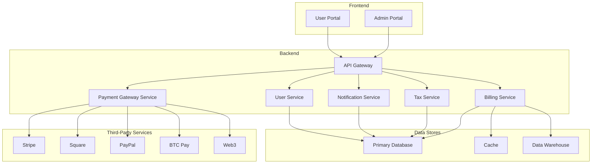

# System Architecture: Multi-Payment Gateway Billing System

This document outlines the complete system architecture for the multi-payment gateway billing system. It is based on the comprehensive research conducted in the previous phase and provides a detailed blueprint for the development and implementation of the platform.

## 1. System Architecture Diagram

## 2. Component Specifications

This section will provide detailed specifications for each component of the system, including:

*   **Frontend Portals:** Admin and User Portals
    *   **Admin Portal:** A web-based interface for administrators to manage the entire billing system. Key features include user management, subscription management, invoice management, payment tracking, tax configuration, and reporting.
    *   **User Portal:** A web-based interface for end-users to manage their own subscriptions, view their billing history, update their payment methods, and make payments.
*   **API Gateway:** The single entry point for all client requests. The API gateway will be responsible for request routing, authentication, and rate limiting. It will also provide a unified API for all the backend services.
*   **Billing Service:** The core service responsible for managing subscriptions, invoices, and payments. This service will handle all the business logic related to billing, including creating and managing subscriptions, generating invoices, processing payments, and handling dunning.
*   **Payment Gateway Service:** A service that integrates with multiple payment gateways using the adapter pattern. This service will provide a unified interface for processing payments, regardless of the underlying payment gateway. It will also handle the complexities of integrating with each gateway's API.
*   **Tax Service:** A dedicated service for calculating and managing taxes. This service will be responsible for calculating taxes based on the user's location and the products they are purchasing. It will also handle tax reporting and compliance.
*   **Notification Service:** A service for sending email and other notifications to users. This service will be used to send notifications for events such as new invoices, payment reminders, and subscription renewals.
*   **User Service:** A service for managing user accounts and authentication. This service will be responsible for creating and managing user accounts, as well as authenticating users and managing their permissions.

## 3. Database Schema

This section will define the database schema for the system, including tables for users, tenants, subscriptions, invoices, payments, and tax rates. The detailed schema is available in [design/database_schema.md](design/database_schema.md).

## 4. API Design

This section will provide the OpenAPI/Swagger specifications for the system's APIs. The detailed API design is available in [design/api_design.md](design/api_design.md).

## 5. Payment Gateway Integration

This section will detail the adapter pattern implementation for integrating with multiple payment gateways. The detailed design is available in [design/payment_gateway_integration.md](design/payment_gateway_integration.md).

## 6. Tax Calculation and Compliance

This section will describe the design of the tax calculation and compliance module. The detailed design is available in [design/tax_compliance.md](design/tax_compliance.md).

## 7. Security Architecture

This section will outline the security architecture of the system, including PCI compliance considerations. The detailed design is available in [design/security_architecture.md](design/security_architecture.md).

## 8. Extensible Ontology Framework

This section will describe the implementation of the extensible ontology framework. The detailed design is available in [design/extensible_ontology_framework.md](design/extensible_ontology_framework.md).

## 9. UI/UX Wireframes

This section will provide wireframes and component specifications for the admin and user portals. The detailed design is available in [design/ui_ux_wireframes.md](design/ui_ux_wireframes.md).

## 10. Technology Stack and Deployment Architecture

This section will recommend a technology stack and describe the deployment architecture for the system. The detailed design is available in [design/technology_stack.md](design/technology_stack.md).
